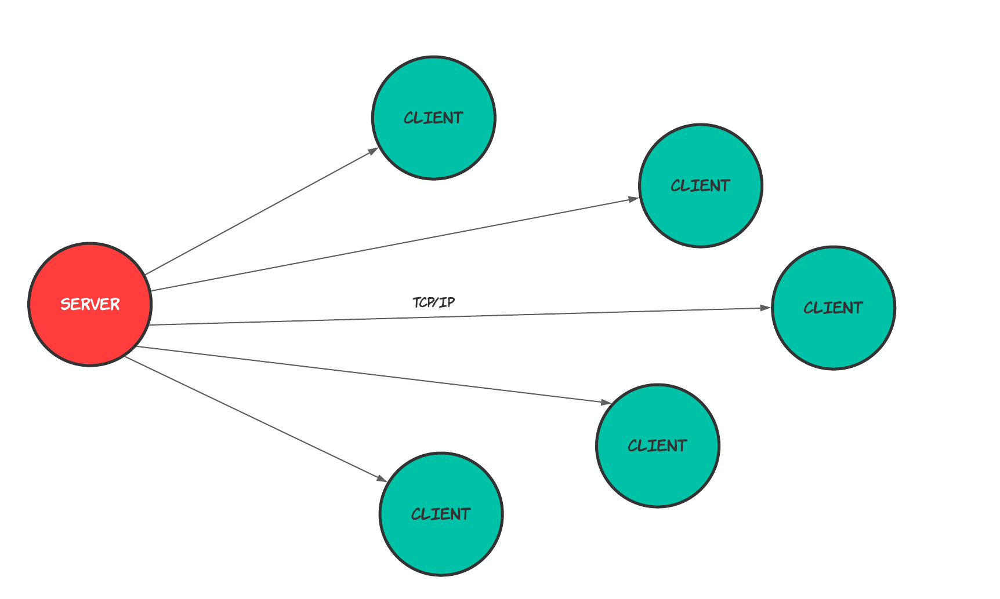
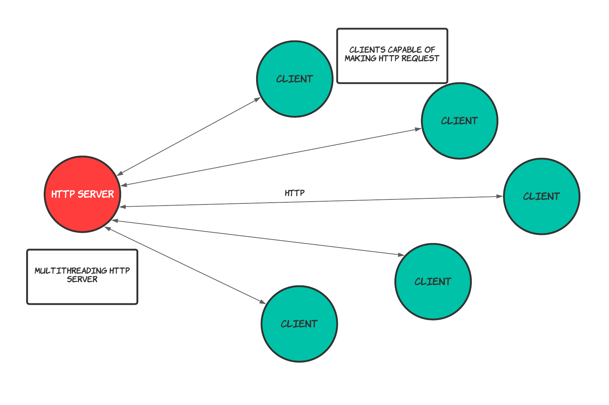

# Salamandra tcp

This is a personal project for fun. I wanted to do a broadcast using TCP sockets in Rust lang.

My idea was build two programs, one that would send binary files or text files (the Server) to multiple clients (like a broadcast), and to other hand a program that would receive these files (the Client).

The client would be installed in various computers.

In this image you can see th currect model or at least the model that I wanted achieves. Here the server send data to clients without previous negotiation and over TCP.

In this other imagen is the model I want to reach

# Features

- [x] server able to send binary files
- [x] client able to receive binary files
- [ ] multiple receivers
- [ ] data integrity in all case
- [ ] server config file (parameterizable)
- [x] client config file (parameterizable) 
- [ ] data encryption
- [x] communication protocol over tcp
- [ ] automatic client register in server (signs of life from clients)
- [ ] CLI with some commands
- [ ] HTTP, TLS, SSL 

